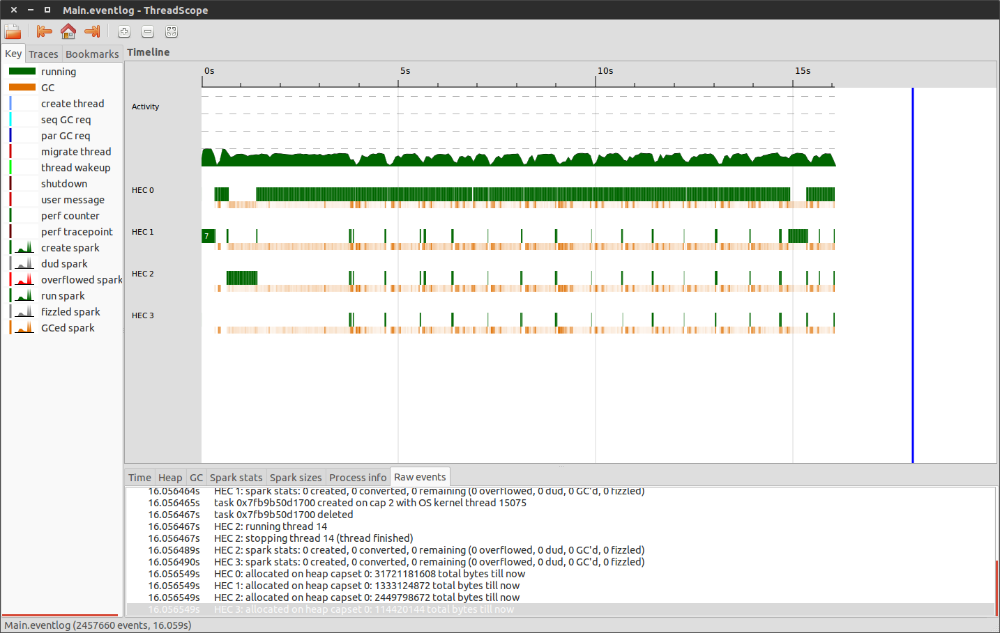
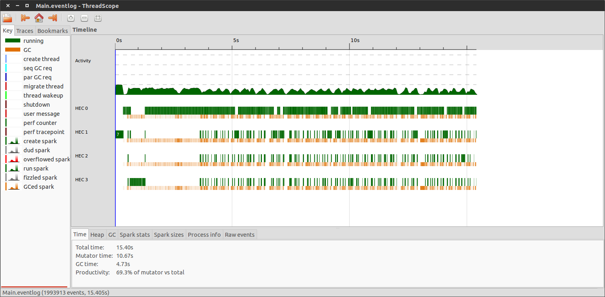

DM-AtariAI
==========
A Haskell implementation of the Deep Mind Atari AI. Work has been done here https://github.com/kristjankorjus/Replicating-DeepMind to build the bot in python and I am referring to it for ideas of the impementation.

## Base Features

- [X] Strict named pipe interface
- [X] Frame preprocessing
- [X] Neural Network Initilaization
- [X] Neural Network Output function
- [ ] Neural Network Training function
- [X] CPU 4D tensor convolution with stride paramter
- [x] GPU 4D tensor convolution with stride parameter


##Running

```ghc -O2 -threaded Main.hs```

```./Main +RTS -N```

##Dependencies

ALE (Arcade Learning Environement) and its dependencies


## Release - 0.1
Both CPU and GPU convole have been implemented.

The GPU implementation is on par with performance with the CPU implementation but it should be possible to make it much faster. A very large array is copied to gpu memory every frame right now, it might be possible to construct this large array on the gpu for better performance.

The GPU load shows that the cpu activity is poorly saturated and severely off balance.


## Release - 0.2
The GPU convolve now is ahead of the CPU convolve in terms of speed after building an large array on the GPU instead of doing an expensive memcopy. The CPU load balancing is decidedly better but still has room for improvement.


